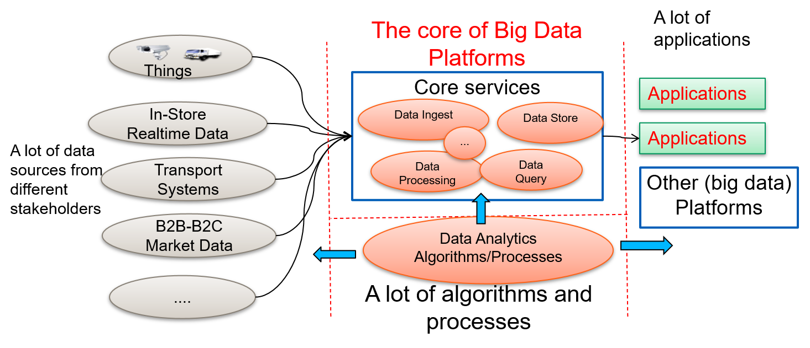

# A Bird view on Big Data Platforms

## Some key questions
And you know that **big data** is characterized many V properties (volume, velocity, variety, varacity, ...) and a **platform** must be able to facilitate different types of interactions for exchanging data and services. You face with different questions related to the development and operation of big data platforms and their big data pipelines:
* how to design the big data platform which can be resilient, elastic and responsive that allow different customers and applications to be integrated?
*  which are the data models you have to select?
*  whether you have to support batch or streaming processing?
*  etc.

Also very practical issues like: should you use public cloud infrastructures or build your own. Which cloud companies should you rely? Google, Amazon or Microsoft?
> Of course you realize that a big data platform must be built with cloud technologies and also many other parts of your requirements are for cloud applications and services. Therefore, you may not need to challenge the question of "should I use cloud technologies?"

Your story is not centered around a "narrow scope" of big data processing, like taking a lot of data, puting them into Hadoop and running machine learning (ML) algorithms (although it is not easy to achieve the work in such a "narrow scope") but you need to deal with a big picture of many tasks in big data platforms, involved in designs with [microservices](https://microservices.io/), [reactive systems patterns](https://www.reactivemanifesto.org/), big data storage and database, complex data ingestion, various data processing models and algorithms atop them, to name just a few.

## Onion View

The implication of this view w.r.t. study:

* if you have a great skill in cloud/virtualization environment, it is easy for you to deploy things but then you need to extend your knowledge into middleware and data services
* if you have a great skill in the outer layer, you use to work with services, etc. then you may need to understand middleware platforms more.
* if you are in between then you may need to go deep into the integration between  two sides.

## System of Systems View

Another view is from system of systems. It is easy to see that a big data platform can connect many subsystem.

The implication of study is that
* if you are familiar with sensing, data collection, etc. You might have a great skill of ingestion protocols then you may focus on data pipelines for ingestion and collection.
* if you work on middleware platforms. you may need to understand data sources and consumer requirements well. You may need to focus on key core services of the platforms.
* if you are consumers then you may need to focus on analytics, data ingestion, analytics service.

## Key components in big data platforms

It is easy to think that big data and data science are mainly about data analysis algorithms, such as machine learning and deep learning. In fact, to apply big data analytics, we need to master the software systems that enable various services for big data analytics, including storage, ingest, processing, etc., as well as  big data pipelines/workflows that encode algorithms for data analysis.

### Software systems

The first thing is to see that we have software systems, even many software systems, that we need for our work in big data platforms. Such software systems can have many services (with well-defined interfaces), libraries, tools, etc. for us to perform various tasks. Failed to see that we have to deal with such software systems might lead to the lack of knowledge preparation.

### Platforms, Programming Frameworks and Processes

An interesting point is that we have many data sources but in practice, only a few powerful big data platforms and frameworks that serve for many applications. Thus, in terms of frameworks and platforms, many features might be similar. So the question is where will be the key issue: a lot of algorithms and analytics processes. After selecting suitable frameworks and platforms, the key focus is about algorithms and processes.

### Computing Infrastructures and  Systems

We need strong, distributed computing resources. It is important to think about virtual machines, containers, Kubernetes-based resource management for  scalability.

### Skills
We learn to **big data platforms** from an individual perspective. But practically, no single person would be able to build a realistic, production-ready big data platform. The skills for building big data platforms are diverse. We must include various people that are able to deal with programming, infrastructures and domain algorithms. As big data training and knowledge mostly comes from IT people at the beginning, IT people tends to introduce big data from the lens of computer science and engineering. Thus one might be impressed that the team is mainly about IT people building complex IT infrastructures, database systems, etc. In fact, the work on understanding big data requires many more domain skills.

In practice, often we are end-up into two situations:

* IT centric team: we have many IT people with strong knowhow on buidling infrastructures, how to program, etc. But they may not understand the data very well. Thu, they may not know the domain knowledge to be captured for writing the algorithms in the right way.

* Domain centric team: We have a problem that the team cannot establish strong infrastructures and tools to develop big data. Therefore, it can lead to situations of using the wrong tools, unscalable systems, etc., for the real world problem.

We need to avoid such situations to have the right team. From our experiences, it requires a strong team collaboration and building across domains. Unfortunately, in the context of the study course, you will build your learning alone (of course with exchanges with other colleagues). Therefore, you should try to explore your best skills and focus more on aspects that you can contribute most and keep in mind that in practice, other aspects can be covered by other people in your team.

## Computing resources for learning
Having enough computing resources for practicing big data platforms is tricky for many students and practitioners because they might need several machines to setup different services and to scale big platforms to a large number of machines. It is not possible in many situations due to the lack of resources for study. We learn big data platforms but we will have limited resources to understand practice issues of big data platforms.

Here are best practices that we have learned from dealing with this issue:

* Use free cloud resources in a good way: e.g., you get a Google credit which is not much but you can allocate enough number of instances in a limited time to test your idea. In this case, you cannot learn much about the scalability and elasticity of big data platforms but you can see a minimum configuration.

*  Try to use existing scalable cloud services offered by others: such services can be free or paid, e.g., Google Big Query, [Cloud AMQP](https://cloudamqp.com), [Cloud MQTT](https://www.cloudmqtt.com/), or [MongoDB Atlas](https://www.mongodb.com/atlas/database). You get a limited configuration of components in a big data platform but such components are configured for real-world big platforms for your study.

* Using your own resources: your laptop can be powerful enough to run containers and virtual machines. You can have some mini configurations of big data platforms. For example, we can run ElasticSearch, MongoDB or Hadoop in Raspberry PIs, laptops and workstations.

> Even we do not have enough resources, keep in mind that your designs, development and tests are for big data platforms with minimum configurations.
