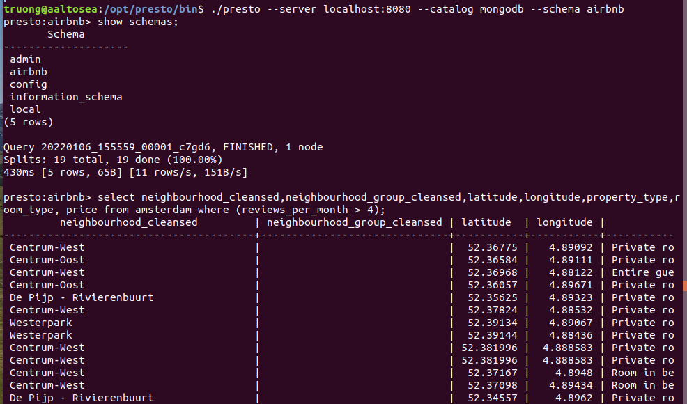
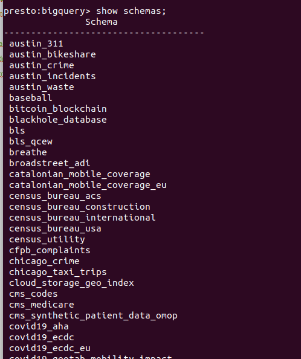
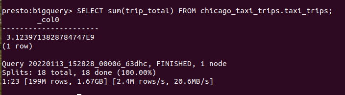
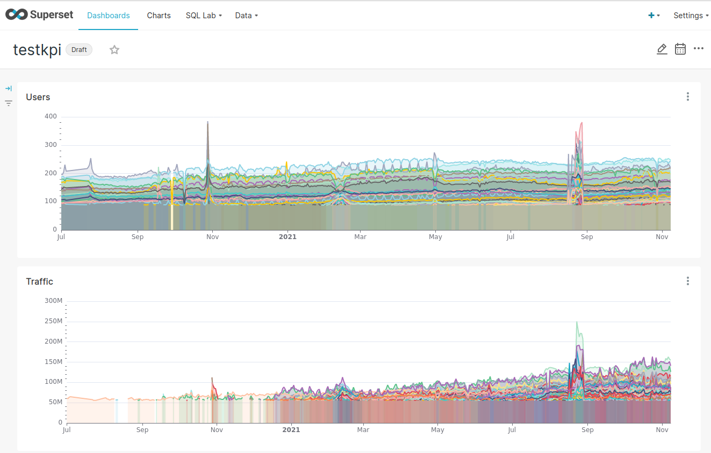

# Distributed SQL Query Engine

One of the big data analytics models is to use suitable query engines to interface to multiple sources of big data. It is for example the way how [Presto](https://prestodb.io/) supports big data querying.


After playing with this simple example, can you image that to follow this solution, are you able to deal with all use cases you have for big data? Of course, you should imagine that maybe you can interface to many other types of data sources you have, like Cassandra, MySQL, etc.

## Example with Presto

#### Setup a single mongodb
Several tutorials show how to setup a MongoDB (e.g., ). Here we just show how to set a single MongoDB running in a container.
```
$docker pull mongo
$docker run --name presto-mongo -p 27017:27017  -d mongo
```
>Note: here we just run mongo as a single server, no username, password.

Next step, you can download [a listing AirBnB public dataset for amsterdam](http://data.insideairbnb.com/the-netherlands/north-holland/amsterdam/2021-11-04/data/listings.csv.gz) and then import the dataset into MongoDB.
>Note: we use mongoimport tool and we unzip the file into listings.csv

```
mongoimport --host=localhost --port=27017   -d airbnb -c amsterdam   --file=/home/truong/temp/listings.csv  --headerline --type=csv
```

#### Setup a Presto

[Setting up Presto](https://prestodb.io/docs/current/installation.html) and relevant components might require some IT/computer science skills but you can make a try.  If you are not able to get Presto and relevant components to run the simple test, let try to ask other IT people
>But if you could not set it up, it is a good sign to understand the complexity of big data analytics

#### Configure Presto access MongoDB
The document of Presto explains how to do this. We just use this simple **mongodb.properties** (under etc/catalog of Presto installation) for our test:

```
connector.name=mongodb
mongodb.seeds=localhost

```
because:
- we setup the document MongoDB without username and password (not a good way but here we just illustrate a very very basic example)

#### start a query from Presto client

>Remember to have the Presto client as described in [Presto installation](https://prestodb.io/docs/current/installation/cli.html)

```
select neighbourhood_cleansed,neighbourhood_group_cleansed,latitude,longitude,property_type,room_type, price from amsterdam where (reviews_per_month > 4);
```


## Presto with BigQuery

For example, in order to use the public dataset, we create a project, within that project we have a service account. Then we use the configuration
```
connector.name=bigquery
bigquery.project-id=bigquery-public-data
bigquery.credentials-file=/opt/presto/etc/catalog/simplebigquery-337017-4cfbc650ceae.json
```
>Note: usually we access dataset in the project we create. However, in this case, the project is only for creating the service account to access BigQuery DataSet.

### Check Schemas

```
truong@aaltosea-P620:/opt/presto/bin$ ./presto --server localhost:9090 --catalog bigquery --schema bigquery
presto:bigquery> show schemas;
               Schema
-------------------------------------
 austin_311
 austin_bikeshare
 austin_crime
 austin_incidents
 austin_waste

 ```

>Note: in my system I set Presto server with port 9090. The default one is 80808.




### Make a simple query
```

presto:bigquery> SELECT sum(trip_total) FROM chicago_taxi_trips.taxi_trips;
        _col0
----------------------
 3.1239713828784747E9
(1 row)

Query 20220113_152828_00006_63dhc, FINISHED, 1 node
Splits: 18 total, 18 done (100.00%)
1:23 [199M rows, 1.67GB] [2.4M rows/s, 20.6MB/s]

```


## SQL-on-Hadoop or SQL with big databases
Presto is distributed query enginee but there are many powerful big databases offering SQL-style queries. Such powerful databases may be more than a database at they include analytics features. They might rely on very large-scale, complex data infrastructures. Some cases, they are [data lakes](https://en.wikipedia.org/wiki/Data_lake). Therefore, they alone can be enough for many use cases.

You can take a look at Google BigQuery, Apache Druid, [Apache Hudi](https://hudi.apache.org/), etc.

## Interactive analytics, Dashboards and Visualization.
With distributed query engines and SQL-on-Hadoop or similar techniques that allow us to issues sql-style analytics to very big data sources, we can enjoy many powerful tools for BI, interactive analytics, dashboards and visualizations.

One example is [Apache Superset](https://superset.apache.org/), which can be used to create dashboards of powerful charts with many big databases/datasets. The following figure shows an example of network monitoring data, where the data is from a big database based on [Apache Druid](https://druid.apache.org/)


