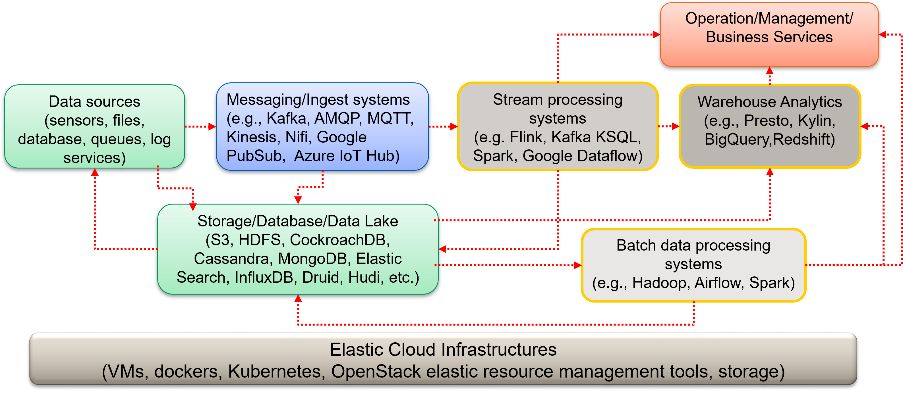

# Open source big data platforms

Big data  platforms are so complex. Therefore, we rely a lot of open source services and systems to build big data platforms. Such open sources have been developed since many years and they play a crucial role in the big data ecosystems.

## Building the big data infrastructure
The big data infrastructure has several components. At the high-level we need to:

* Combine dedicated servers + VMs
    - Establish elastic infrastructure using elasticity and virtualization

* High performance
    - Enable running parallel and concurrent programs for database, messaging, and analytics

* Broker/messaging services
    - Large-scale, high performance with standard protocols, such as AMQP and  MQTT
    - Support different messaging systems, e.g., RabbitMQ & Apache Kafka

* Datastore technologies: data storage, databases and data services.

* Processing frameworks

many concepts are difficult and require fulltime training from the university in the computer science programme.

## A reference of Big Data Platform for our study

We will follow the following Big Data Platform reference as the key one for our study in this book.

The particular systems to be used are dependent on requirements. The systems mentioned are state-of-the-art ones. We expect that new systems will come and old systems will disappear. However, key interactions and components required for big data platforms would remain.

## Build your personal techradar for big data platforms
Since there are many technologies that you can choose, it would be better to build [a techradar](https://www.thoughtworks.com/radar/byor) for your big data expertise. In your personal techradar you can basically focus on a subset of tools/software that you can use for building your big data platforms and you continue to evaluate and revise your radar, based on your expertise, customer requirements, data to be handled, etc.

* Select an application domain, a dataset and have simple scenarios for your big data platform
* Decide which technologies could be used, based on your constraints and knowhow
* Evaluate software and services for building your big data platform

If we look at a [snapshot of existing technologies available for big data platforms](https://mattturck.com/data2020/), we are overwhelming with the number of technologies and solutions that have been evolved in a short time. So would we focus our study in a particular set of technologies, some well-known software stack? **No. We should not!.** As a fundamental study for building big data platforms, we should learn basic principles and techniques. But we will need to apply these principles and techniques with a subset of selected technologies (based on their popularity and easy to study).

## Potential software technologies and services for big data platforms

|Provider| Technologies|
|-----|---|
| Google Cloud Platform |You can scan the [list of services](https://cloud.google.com/solutions/smart-analytics) from a perspective of solutions. You can also review services/technologies based on  the data-lifecycle of ingestion, storing, analysis and visualization](https://cloud.google.com/solutions/data-lifecycle-cloud-platform)|
|Microsoft Azure Cloud| Available services can be viewed from [a service catalog for analytics](https://azure.microsoft.com/en-us/services/#analytics) or from a [solution catalog](https://azure.microsoft.com/en-us/solutions/big-data) |
|Amazon Web Services | Serverals [Database services](https://aws.amazon.com/products/databases/) and [Analytics services](https://aws.amazon.com/big-data/datalakes-and-analytics/)|
|Apache | Apache provides several important free software for big data studies. Many of these software are also optimized and offered by existing providers. Examples are: [Hadoop](https://hadoop.apache.org/),[Spark](https://spark.apache.org/),[Cassandra](https://cassandra.apache.org/),[HBase](https://hbase.apache.org/), [Kafka](https://kafka.apache.org/) and [Airflow](https://airflow.apache.org/)|
| ELK stack | ELK Stack, [ELK - ElasticSearch, Kibana, Logstash](https://www.elastic.co/elastic-stack), includes a software technology stack for solutions as well as for end-to-end data lifecycle services.|
| TICK stack| The TICK  Stack - [Telegraf, Infuxdb, Chronograf, Kapacitor](https://www.influxdata.com/time-series-platform) - also offers a software technology stack for end-to-end data lifecycle services, focused on time series data |

When exploring these technologies/services, you can note the following things:

* Which services have similar functionality (and built from similar/the same software)?
* How a service is coupled with  underlying cloud infrastructures?
* What are the coupling models/dependencies among services?
* What are constraints/properties w.r.t. price, privacy, security, programming support, etc.

Then try to address the following points:
* Why do you think that the tools in your personal techradar are suitable for your work/study?
* What would possible issues when we use a single software stack?

## Learning from the real industries
Since the industry has a lot of data, many companies deal with big data daily and they report various interesting situations. We should try to follow what happens in the real-world. Examples:

* [Real-time Data Infrastructure at Uber](https://arxiv.org/pdf/2104.00087.pdf)
* [Uber’s Big Data Platform: 100+ Petabytes with Minute Latency ](https://eng.uber.com/uber-big-data-platform/)
