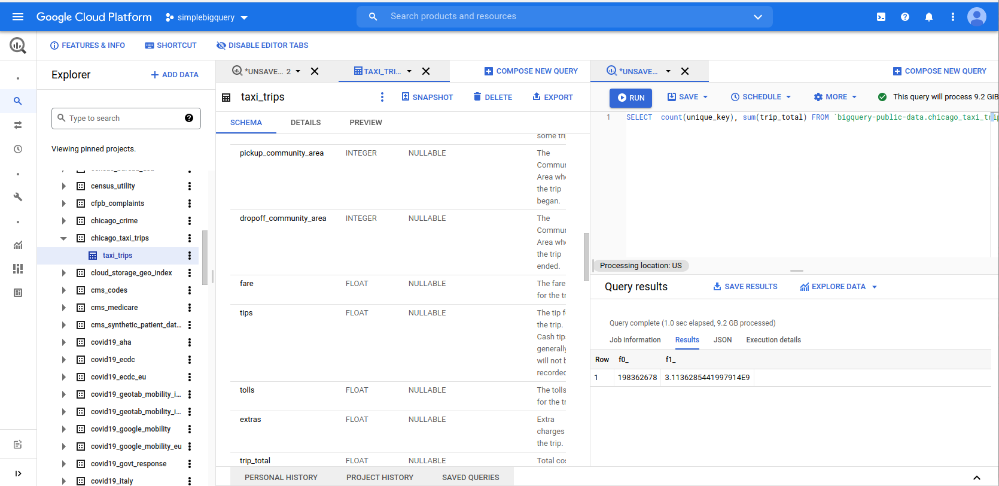

# The first taste of  big data analytics

### How would you start your big data analytics
Say you need to analyze a big amount of data for your work (e.g., in a company dealing with different customers, as student doing analysis of data produced by manufacturing processes). Dependent on who are you, when starting big data analytics, you might think:
- like a data scientist or a programmer: start with [Pandas](https://pandas.pydata.org/), [Jupyter Notebook](https://jupyter.org/), and other popular libraries/tools like [Numpy](https://numpy.org/), [Mathplotlib](https://matplotlib.org/), [spaCy](https://spacy.io/) (text processing), [GeoPandas](https://geopandas.org/en/stable/) (for geodata). These libraries and tools are well-known and there are endless of blogs and papers showing how to use them for data analytics.
- like a business analyst or scientist who does not want to dive deep into the programming with Python, Java, GoLang, etc: start to write [some queries as BI systems](https://cloud.google.com/bigquery/docs/bi-engine-intro) would help you to deal with all low-level details.

>The reasons for your way vary: maybe you already have some training in common data analytics. You might already be familiar with analysis using excel or your professor in the hot data science course shows you the beauty of Jupiter Notebook.

So let us practice a bit, even though you might not be familiar with the following tools, you might find some common problems when working with big data.

### The programming way: Pandas, Dask or Spark for Taxi Data

We get a reasonable big dataset: [the NY taxi](https://www1.nyc.gov/site/tlc/about/tlc-trip-record-data.page) and try to run/write some simple programs which just, for example,  sum up how much money generated from trips in a month or how many trips have been. At the end, NY is a big city and we are probably aware of the size of taxi services there.

First, we can start with just 1 month of data. For example you can down load the [Yellow Trip data for Jan, 2021](https://s3.amazonaws.com/nyc-tlc/trip+data/yellow_tripdata_2021-01.csv) and then run our simple calculation program [pandas_tax_amount_calculation.py](code/pandas_taxi_amount_calculation.py) which mainly use Pandas dataframe sum function:

```python
total_amount =taxi_df["total_amount"].sum()
```

What do you get? Mostly the program will be executed successfully and you will get:

```
$python pandas_taxi_amount_calculation.py -i yellow_tripdata_2021-01.csv
The total amount calculated from this file is 23935806.440000005
```
But what if you have to calculate the amount for all monthly data? Maybe you can download
[2018 Yellow Taxi Trip](https://data.cityofnewyork.us/Transportation/2018-Yellow-Taxi-Trip-Data/t29m-gskq) and run again the program? If you your laptop is powerful, maybe the program will finish after a certain amount of time (fast enough?). My case was not

```
$python pandas_taxi_amount_calculation.py -i taxi-2019download.csv
Killed
```
because Pandas cannot handle such a big data file (only 10G) in my laptop (with 16GB RAM and 8 cores).

>Note that the size of the file in my system is 10428263736 bytes. You may have a different size, due to the update of the data.

Now let us change a bit of the code. Here we use [Dask](https://docs.dask.org/en/stable/) but still in a single machine. The code ([dask_taxi_amount_calculation.py](code/dask_taxi_amount_calculation.py)) is not much different:

```
import dask.dataframe as dd

taxi_df =dd.read_csv(input_file)
total_amount =taxi_df["total_amount"].sum().compute()
```
and the result is
```
python dask_taxi_amount_calculation.py -i nytaxi-2019download.csv
The total amount calculated from this file is 1837861124.9500003
```
How can Dask help to run the program successful?

Let us see if you can use [Apache Spark](https://spark.apache.org/). Still in a single machine, we have a different program. The structure of the Spark program ([spark_taxi_amount_calculation](code/spark_taxi_amount_calculation.py)) is not much different from the Dask or Pandas ones. Are you successful? Mine runs fine.

So what do you see here? The same hardware but using different frameworks, the success is different, while the data analysis programs are look quite similar! **Here are the first point**: big data needs suitable frameworks to handle the data, although at the high-level view, one might see similar things. The specific techniques for big data are within the design of such frameworks.


### The BI style, the SQL with big data

Let us use [Google BigQuery](https://cloud.google.com/bigquery), which provides a free, limited usage so you can test it. Like many big data platforms, which store a huge amount of data and support different kinds of analytics, you can carry out many data analytics tasks using familiar SQL-style queries in a similar manner to what you would do with relational databases in typical works. For example, creating a Google Cloud project with BigQuery and selecting an open dataset, you can start making a query on big data.

>Select the Chicago taxi trips from Google BigQuery and sum up the total amount. The snapshot shows that the query needs to process 9.2GiB of data. How long does it take?



There  are many other solutions, as you go along with this introduction of big data analytics and platforms, you will see that they offer similar ways of SQL style to run analytics in terabytes/petabyties of data

### Juyter Notebook way

Let us say we want to use Jupyter Notebook, the popular tool for data science to do the data analytics. Here is a simple way to do with your own Notebook
- Setup Notebook and Pandas
- Download [the twitter dataset](https://www.kaggle.com/deepcontractor/squid-game-netflix-twitter-data)
- Launch [our simple program](code/firsttastesquidgame.ipynb), modify the input data and run


> You can go  to Kaggle and create a notebook then add [squid game twitter dataset](https://www.kaggle.com/deepcontractor/squid-game-netflix-twitter-data)


https://www.kaggle.com/linhsolar/firsttastesquidgame/edit

### Combining different ways

You can also combine different ways. For example from Pandas you can connect to Google BigQuery using  [Python BigQuery Pandas](https://github.com/googleapis/python-bigquery-pandas). For example, this simple program [pandas_bigquery_chicago_taxi_amount_calculation.py](code/pandas_bigquery_chicago_taxi_amount_calculation.py) would produce:

```
python pandas_bigquery_chicago_taxi_amount_calculation.py -c simplebigquery-337017-4cfbc650ceae.json -p simplebigquery-337017
The total amount calculated  is 3123971382.819864
```

 Similarly [BigQuery-Spark Connector](Spark https://cloud.google.com/dataproc/docs/tutorials/bigquery-connector-spark-example) allows you to process BigQuery from Spark.

Welcome to the basics of big data analytics!

### Observations and questions

Maybe you already have some questions: what would be **"behind the scenes"** so that Dask or Spark programs work but not the Pandas one? How would Google BigQuery handle such a large amount of data in a short time? Why cant you do the same thing with your deployment of simple PostgreSQL? One of the first observations you might see that we need to use suitable frameworks/techniques when analyzing big data as these frameworks/techniques not only do the heavy lifting for the user but also know how to deal with a lot of resources (or the limited resources) for big data.

Whether you follow the high-level BI style analytics or the low-level programming ways, you already see that there are many different ways for dealing with big data. Not a single one will meet all the requirements. Furthermore, this first taste shows you that we need to deal with different types of data and they might come from different places.
